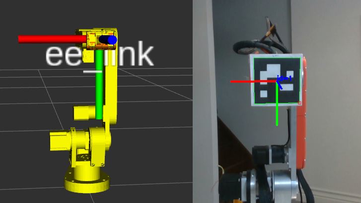

# AR4 Hand Eye Calibration

Performs hand-eye calibration between a camera and the Annin Robotics AR4 robotic arm,
and validates calibration results. An DepthAI camera is used as an example,
but any camera can be substituted. Tested with ROS 2 Jazzy on Ubuntu 24.

[](https://youtu.be/w3tWKYnLL98)

The core calibration procedure uses [easy_handeye2](https://github.com/marcoesposito1988/easy_handeye2).

## Preparation

Print an Aruco marker and attach it to the end of J6. Aruco marker can be printed using
[ros2_aruco](https://github.com/JMU-ROBOTICS-VIVA/ros2_aruco?tab=readme-ov-file#generating-marker-images).

Note that the marker needs to be aligned with `ee_link` as shown in the picture below.
Aruco marker pose can be visualized using `ros2 run ar4_hand_eye_calibration visualize_aruco_marker.py` (run
`ros2 run image_view image_view  image:=/aruco_image` in another terminal to see the image).



Verify that the Aruco marker parameters in `config/aruco_parameters.yaml` is correct for
your marker.

Note: You may want to 3D print an extra J6 gripper mount for this purpose.

## Installation

Clone this repo and [ar4_ros_driver](https://github.com/ycheng517/ar4_ros_driver) in the same ROS workspace.
i.e.

```bash
mkdir -p ~/ar4_ws/src
cd ~/ar4_ws/src
git clone https://github.com/wiktorj/ar4_ros_driver
git clone https://github.com/wiktorj/ar4_hand_eye_calibration
```

Import required repos with:

```bash
vcs import . --input ar4_hand_eye_calibration/hand_eye_calibration.repos
```

Install the required drivers and ROS 2 nodes for your camera. For example for DepthAI:

```bash
sudo apt install ros-jazzy-depthai-ros
```

Install dependencies of imported repos:

```bash
sudo apt update && rosdep install --from-paths . --ignore-src -y
```

## Calibrate

In one terminal, launch the AR4 driver without including the gripper:

```bash
ros2 launch annin_ar4_driver driver.launch.py calibrate:=True include_gripper:=False
```

In another terminal, launch programs needed for calibration:

```bash
ros2 launch ar4_hand_eye_calibration calibrate.launch.py
```

Using RViz, move the robot end effector such that the Aruco marker is in view of the camera. Then, a
calibration GUI should appear on the screen. Use it to take a sample. Then move the end effector
to a few different orientations, take a sample at each orientation. When you have 5-6 samples, you
can save and exit all programs.

## Validate

In one terminal, launch the AR4 driver without including the gripper:

```bash
ros2 launch annin_ar4_driver driver.launch.py calibrate:=True include_gripper:=False
```

In another terminal, launch programs needed for validation:

```bash
ros2 launch ar4_hand_eye_calibration validate.launch.py
```

Move an Aruco marker around the camera'a field of view. The robot arm should follow and hover above
the Aruco marker.


# Example Calibration:

Translation
	x: 0.026390
	y: -0.207219
	z: 0.574821)
Rotation
	x: -0.260063
	y: -0.048720
	z: -0.274176
	w: 0.924565